# Procesverslag
Markdown is een simpele manier om HTML te schrijven.  
Markdown cheat cheet: [Hulp bij het schrijven van Markdown](https://github.com/adam-p/markdown-here/wiki/Markdown-Cheatsheet).

Nb. De standaardstructuur en de spartaanse opmaak van de README.md zijn helemaal prima. Het gaat om de inhoud van je procesverslag. Besteedt de tijd voor pracht en praal aan je website.

Nb. Door *open* toe te voegen aan een *details* element kun je deze standaard open zetten. Fijn om dat steeds voor de relevante stuk(ken) te doen.

## Jij

uitwerken voor kick-off werkgroep

### Auteur:
Adam el Ghareib

#### Je startniveau:
Rood

#### Je focus:
Responsive
 

## Je website

uitwerken voor kick-off werkgroep

### Je opdracht:
link naar de website die je gaat namaken óf de naam/omschrijving van je eigen ontwerp

#### Screenshot(s) van de eerste pagina (small screen): 
https://www.starbucks.nl/
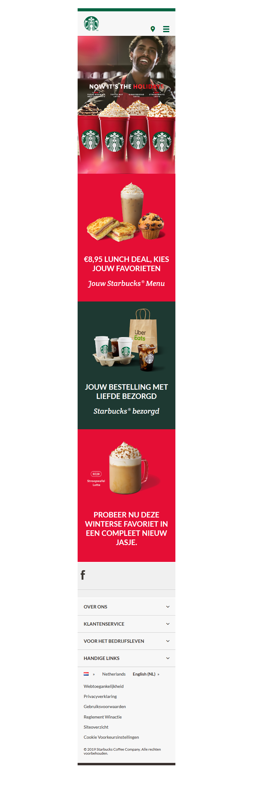

#### Screenshot(s) van de tweede pagina (small screen):
https://www.starbucks.nl/about-us
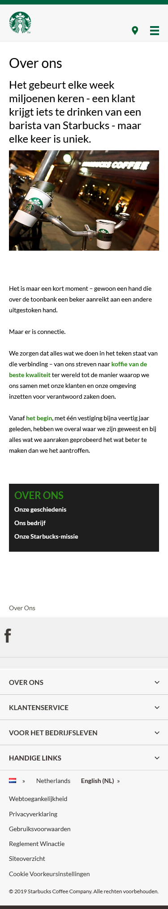
 

## Breakdownschets (week 1)

uitwerken na afloop 2e werkgroep

### de hele pagina: 
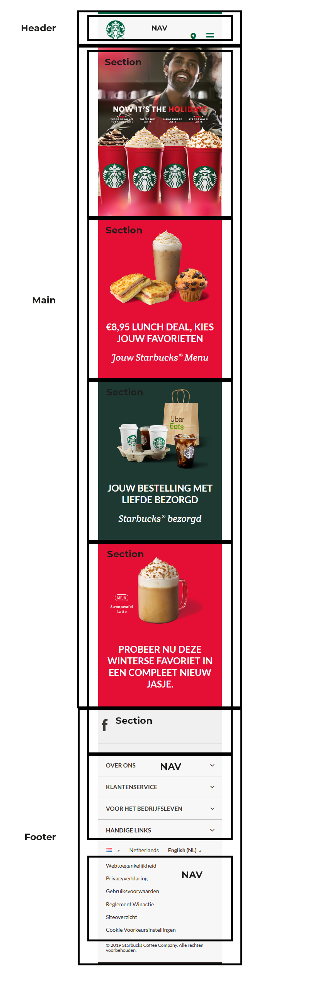

### dynamisch deel:
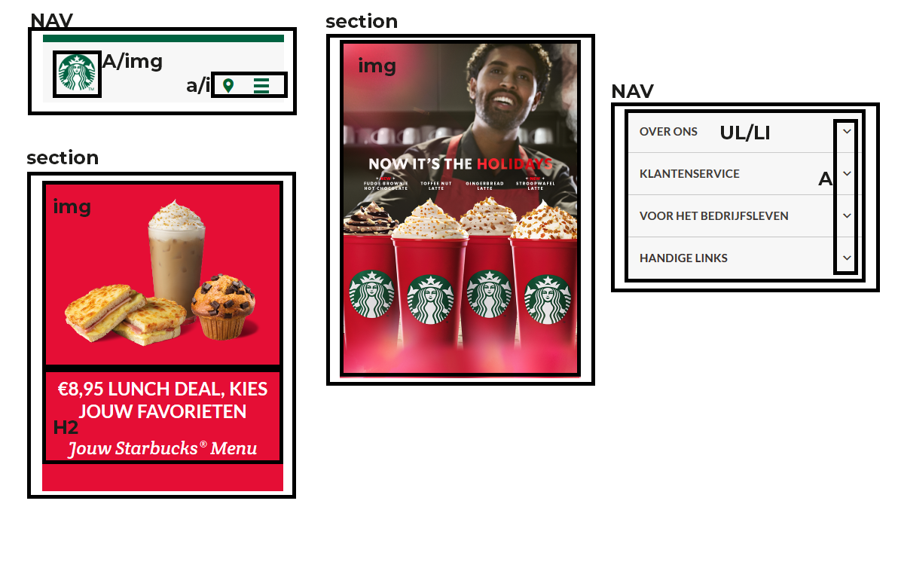

## Voortgang 1 (week 2)

uitwerken voor 1e voortgang

### Stand van zaken

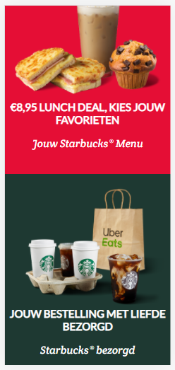
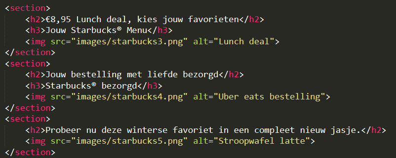
In week 2 heb ik alleen de sections gemaakt en gestyled. Daar ben ik tegen geen probleem aangelopen.

### Agenda voor meeting
samen met je groepje opstellen

Adam:
Coen:
Danian:
Shae:

### Verslag van meeting
hier na afloop snel de uitkomsten van de meeting vastleggen

- punt 1
- punt 2
- nog een punt
- ...

## Voortgang 2 (week 3)

uitwerken voor 2e voortgang

### Stand van zaken

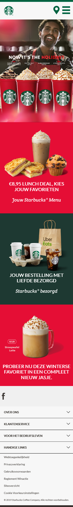
In week 3 heb ik de mobiele versie helemaal afgemaakt.

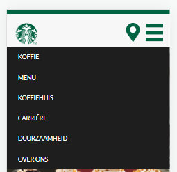
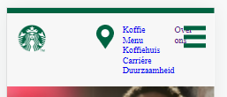
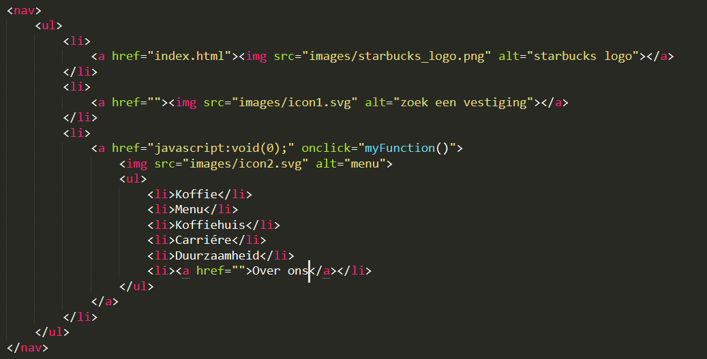
Ik heb alleen moeite met de hamburger menu want het is nog niet klikbaar en als ik het klikbaar maakt dan gaat mijn HTML kapot. Dit gebeurt omdat mijn HTML structuur niet helemaal klopt.

### Agenda voor meeting
samen met je groepje opstellen

Adam: Sections responsive maken.
Coen:
Danian:
Shae:

### Verslag van meeting
hier na afloop snel de uitkomsten van de meeting vastleggen

- Sanne heeft mij geholpen met het fixen van mijn sections.
- Zelf even verder kijken naar CSS grids

## Toegankelijkheidstest (week 4)

uitwerken na test in 8e voortgang

### Bevindingen
Lijst met je bevindingen die in de test naar voren kwamen:

#### ALT's
Ik heb geen ALT's aan mijn plaatjes gebruikt. Dus heb ik aan alle images een alt toegevoegd.

Dit zijn weinig bevindingen omdat anderen en ikzelf niks anders hebben gevonden. De contrast van de pagina is goed en de pagina is makkelijk te besturen.

## Voortgang 3 (week 4)

uitwerken voor 3e voortgang

### Stand van zaken

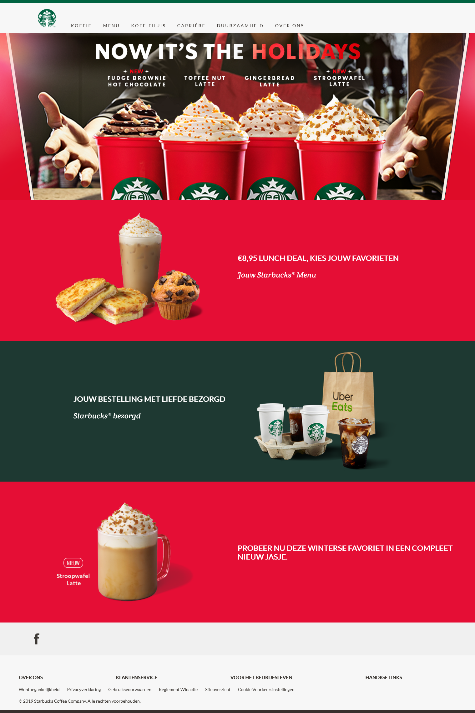
In week 4 heb ik de web versie bijna af en responsive. Ik moet alleen nog een paar kleine dingen stijlen.

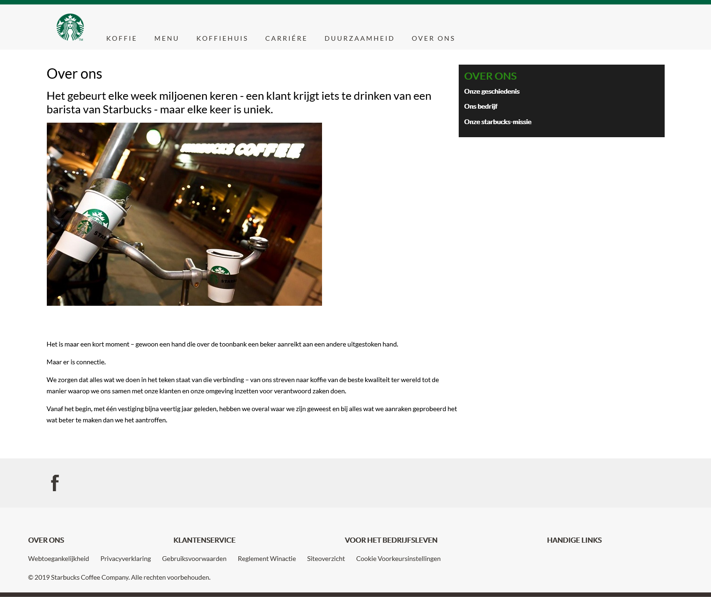
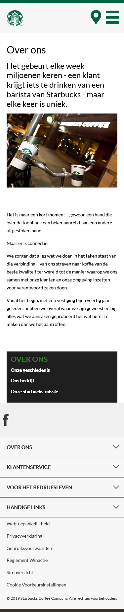
Ik heb ook de over ons pagina helemaal gemaakt en het is responsive.

### Agenda voor meeting
samen met je groepje opstellen

Adam: Checken of mijn pagina responsive genoeg is.
Coen:
Danian:
Shae:

### Verslag van meeting
hier na afloop snel de uitkomsten van de meeting vastleggen

- Yunus vind dat mijn pagina goed in elkaar zit
- Ik kan de github van Yunus checken voor uitklapbare menu's als ik mijn stijling nog wil verbeteren.

## Eindgesprek (week 5)

uitwerken voor eindgesprek

### Stand van zaken
hier dit ging goed & dit was lastig (neem ook screenshots op van delen van je website en code)

### Screenshot(s)

hier screenshot(s) van je eindresultaat

## Bronnenlijst

continu bijhouden terwijl je werkt

Nb. Wees specifiek ('css-tricks' als bron is bijv. niet specifiek genoeg).

1. w3schools.com
2. bron 2
3. ...

