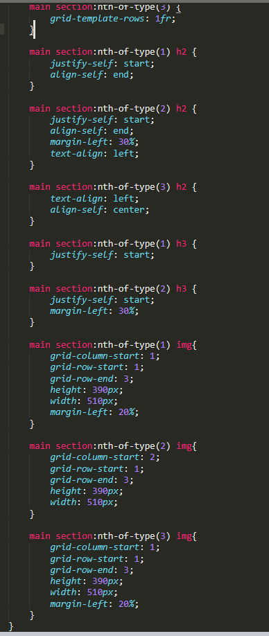
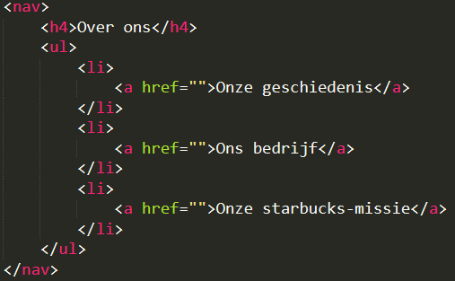
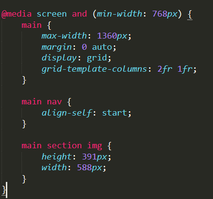
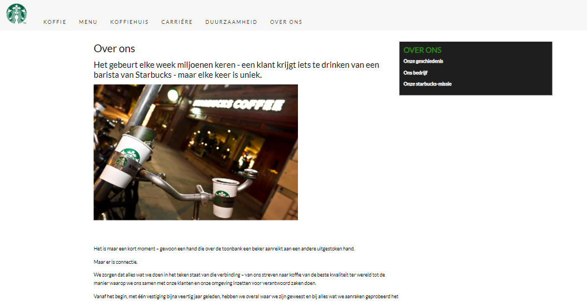

# Procesverslag
Markdown is een simpele manier om HTML te schrijven.  
Markdown cheat cheet: [Hulp bij het schrijven van Markdown](https://github.com/adam-p/markdown-here/wiki/Markdown-Cheatsheet).

Nb. De standaardstructuur en de spartaanse opmaak van de README.md zijn helemaal prima. Het gaat om de inhoud van je procesverslag. Besteedt de tijd voor pracht en praal aan je website.

Nb. Door *open* toe te voegen aan een *details* element kun je deze standaard open zetten. Fijn om dat steeds voor de relevante stuk(ken) te doen.

## Jij

uitwerken voor kick-off werkgroep

### Auteur:
Adam el Ghareib

#### Je startniveau:
Rood

#### Je focus:
Responsive
 

## Je website

uitwerken voor kick-off werkgroep

### Je opdracht:
link naar de website die je gaat namaken óf de naam/omschrijving van je eigen ontwerp

#### Screenshot(s) van de eerste pagina (small screen): 
https://www.starbucks.nl/

#### Screenshot(s) van de tweede pagina (small screen):
https://www.starbucks.nl/about-us

 

## Breakdownschets (week 1)

uitwerken na afloop 2e werkgroep

### de hele pagina: 

### dynamisch deel:

## Voortgang 1 (week 2)

uitwerken voor 1e voortgang

### Stand van zaken

 

 
In week 2 heb ik alleen de sections gemaakt en gestyled. Daar ben ik tegen geen probleem aangelopen.

### Agenda voor meeting
samen met je groepje opstellen

Adam: Is mijn HTML opbouw goed?
Coen: Ik wil de footer fixen, maar krijg die tekst niet zo lelijk in het midden gecentreerd etc.
Danian:
Shae:

### Verslag van meeting
hier na afloop snel de uitkomsten van de meeting vastleggen

- Ik moet alleen de IMG's en H1 in mijn header plaatsen inplaats van de main.

## Voortgang 2 (week 3)

uitwerken voor 2e voortgang

### Stand van zaken

 
In week 3 heb ik de mobiele versie helemaal afgemaakt.

### Agenda voor meeting
samen met je groepje opstellen

Adam: Sections responsive maken.
Coen: Ik wil nog graag de search button (is een <a>) toevoegen, maar zit met een dilemma in de HTML.
Danian: uitwerking socials gedeelte.
Shae: Ik wil de formulier beter laten schalen.

### Verslag van meeting
hier na afloop snel de uitkomsten van de meeting vastleggen

- Sanne heeft mij geholpen met het fixen van mijn sections.
- Zelf even verder kijken naar CSS grids

## Toegankelijkheidstest (week 4)

uitwerken na test in 8e voortgang

### Bevindingen
Lijst met je bevindingen die in de test naar voren kwamen:

- Ik heb geen ALT's aan mijn plaatjes gebruikt. Dus heb ik aan alle images een alt toegevoegd.
- Er staat geen tekst achter het locatie teken. Dus heb ik het zinnetje "Een vestiging zoeken" toegevoegd.
- De contrast van de kleuren zijn goed.
- De screenreader leest de hele header en footer maar slaat de body over.
- Er missen nog een aantal states wanneer je over knoppen of tekst hovert. Dus als je op web over de header en footer hovert veranderd de tekst.
- In plaats van IMG kan ik ook gebruiken maken van de element picture.

## Voortgang 3 (week 4)

uitwerken voor 3e voortgang

### Stand van zaken

 
In week 4 heb ik de web versie bijna af en responsive. Ik moet alleen nog een paar kleine dingen stijlen.
 

 

 
Ik heb ook de over ons pagina helemaal gemaakt en het is responsive.

### Agenda voor meeting
samen met je groepje opstellen

Adam: Checken of mijn pagina responsive genoeg is.
Coen:
Danian:
Shae: Hoe maak ik mijn afbeelding even groot als de orginele afbeelding.

### Verslag van meeting
hier na afloop snel de uitkomsten van de meeting vastleggen

- Yunus vind dat mijn pagina goed in elkaar zit
- Ik kan de github van Yunus checken voor uitklapbare menu's als ik mijn stijling nog wil verbeteren.

## Eindgesprek (week 5)

uitwerken voor eindgesprek

### Stand van zaken
hier dit ging goed & dit was lastig (neem ook screenshots op van delen van je website en code)

Het namaken van de starbucks website verliep best goed. Het is mij gelukt om het responsive te maken. Alleen vind ik dat er veel tijdsdruk op zat i.v.m. andere vakken en mijn leven daarbuiten. Ik weet dat andere studenten met hetzelfde zitten. Daarbuiten vind ik dit een leuk vak en heb ik nieuwe dingen geleerd zoals "Picture, CSS grids, Flexbox".
 

 
Dit is de stijling van mijn sectie op de index pagina. Gemaakt doormiddel van grids. Dit heb ik deels samen met Sanne gemaakt omdat ik hiermee vast zat.

 

 

 
Dit is waar ik trots op ben. Ik heb doormiddel van CSS grids de zwarte nav aan de rechterkant gekregen.

### Screenshot(s)

 

 

 

## Bronnenlijst

continu bijhouden terwijl je werkt

Nb. Wees specifiek ('css-tricks' als bron is bijv. niet specifiek genoeg).

1. https://www.w3schools.com/tags/tag_picture.asp
2. https://www.a11yproject.com/posts/how-to-hide-content/
3. https://css-tricks.com/snippets/css/complete-guide-grid/
4. https://codepen.io/shooft/pen/wvexVgV

